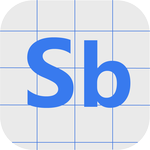

# SmarterBuaa

> 🚧🚧🚧 WIP Warning 🚧🚧🚧

<p align="center">
  </img>
</p>

> This logo is made in reference to the **Photoshop Beta**, which is the abbreviation of SmarterBuaa, I think it's pretty good and hope you like it :)

> 注: 本项目只用于学习分享, 请于下载后 24 小时内删除, 使用产生的一切问题由使用者自行承担, 如有侵权我将删除此储存库和软件
>
> Tips: This project is only for learning and sharing, please delete within 24 hours after downloading, all problems caused by the use are borne by the user, if there is any infringement I will delete this repository and software

## Building

- For Windows

```sh
dx build -r --windows
```

- For Android (No sign)

```sh
# Set up JDK, Android SDK, Android NDK 28.0.12433566
# rustup target install aarch64-linux-android
dx build -r --android --target aarch64-linux-android
```
